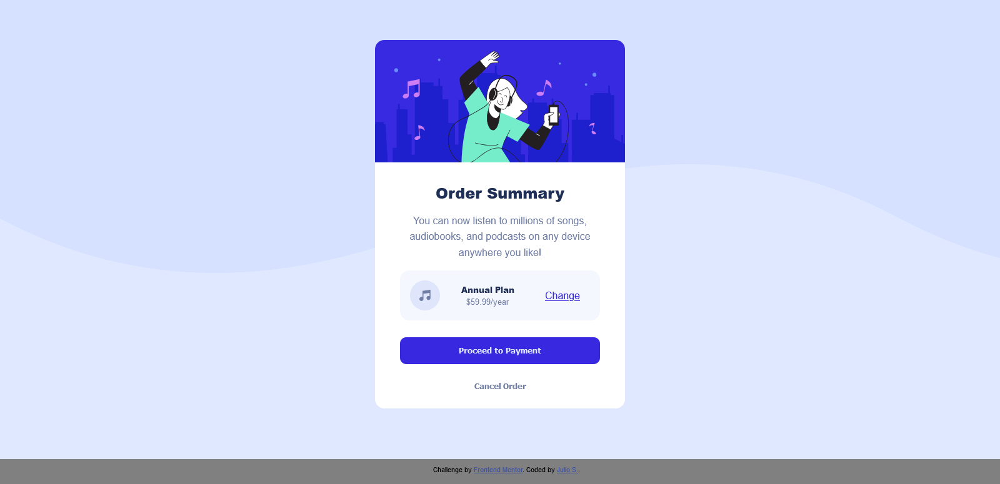
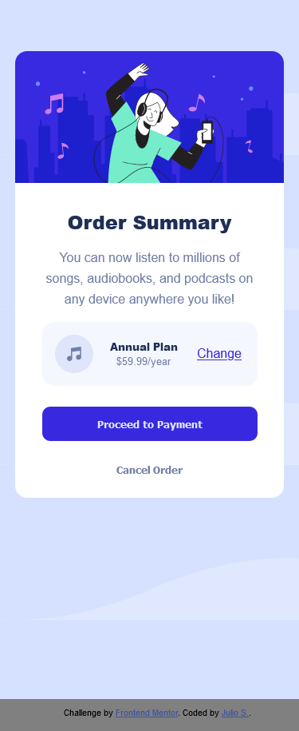

# Frontend Mentor - Order summary card solution

This is a solution to the [Order summary card challenge on Frontend Mentor](https://www.frontendmentor.io/challenges/order-summary-component-QlPmajDUj). Frontend Mentor challenges help you improve your coding skills by building realistic projects.

## Table of contents

- [Overview](#overview)
  - [The challenge](#the-challenge)
  - [Screenshot](#screenshot)
- [My process](#my-process)
  - [Built with](#built-with)
  - [What I learned](#what-i-learned)
  - [Continued development](#continued-development)

## Overview

An order summary that displays the content and price of a music service. It is a responsive design that works in mobile and desktop screens.

### The challenge

Users should be able to:

- See hover states for interactive elements

### Screenshot

## My process

### Built with

- Semantic HTML5 markup
- CSS custom properties
- Flexbox
- Mobile-first workflow

### What I learned

This project help to reinforce the use of flexbox in a responsive design. It helped to reinforce the mobile first desgin method as well as improve html structure.

### Continued development

The section that I want to continue to focus on is making the site more responsive when dealing with growing elements. The container with plan details was the most challenging to format correctly. I want to improve the responsiveness of the plan detail container so that as it grows it keeps it's design properly.
